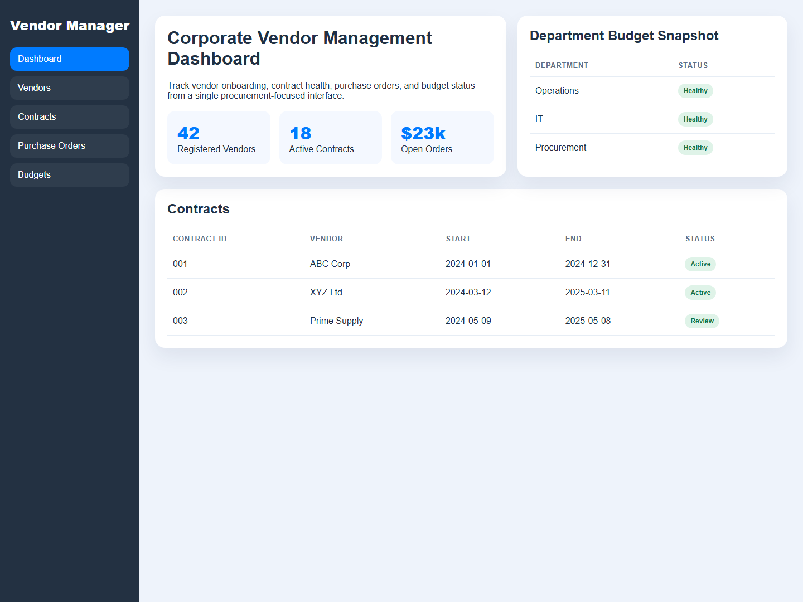
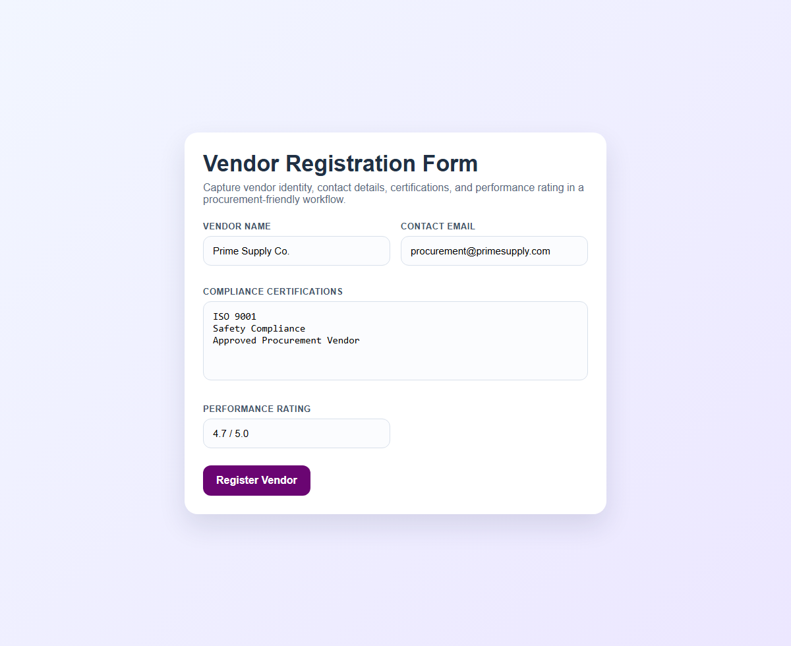

# Vendor Management System

A web-based project for managing vendors, contracts, purchase orders, and departmental budget visibility. The system is structured around procurement and vendor-governance workflows and is intended as a practical database-backed business application.

## Visual Preview

## Overview

This project focuses on organizing procurement-related operations through a vendor management workflow that includes:

- vendor registration and profile tracking
- contract information management
- purchase order handling
- department budget awareness
- database-level automation through triggers and stored procedures

The repository also preserves multiple project artifacts such as interface files, diagrams, a report document, and a presentation deck.

## Main Functional Areas

- Vendor management
  - store vendor identity, contact details, and compliance-related information
- Contract management
  - maintain start dates, end dates, and contract status information
- Purchase order tracking
  - connect purchasing activity with vendors and budget usage
- Budget visibility
  - support department-level allocation and remaining-funds tracking
- Data integrity support
  - use triggers and stored procedures to improve consistency and validation

## Tech Context

The repository description and preserved files indicate a stack centered on:

- Frontend: HTML, CSS, JavaScript
- Backend: Node.js and Express
- Database: MySQL
- Database logic: triggers and stored procedures

## Repository Contents

This repository currently contains:

- front-end HTML pages for the major workflows
- a database/system diagram in Draw.io format
- a project report document
- a presentation deck

Representative files:

- `homepage.html`
- `contract.html`
- `purchase_order.html`
- `performance_evaluation.html`
- `VENDOR_REGISTRATION_FORM.HTML`
- `db_project (1).drawio`
- `Detailed Project Report (2).docx`
- `docs/screenshots/`: README preview images for dashboard and registration flows

## Current Repository Status

This repo is best understood as a preserved academic/project submission bundle rather than a fully packaged production repository.

What is clearly present:

- interface files for multiple system flows
- project documentation and presentation assets
- evidence of database-driven vendor-management design

What would improve it further over time:

- adding a complete backend source structure if separated elsewhere
- adding a setup guide for MySQL schema and Express server startup
- organizing files into clearer folders such as `frontend/`, `docs/`, and `db/`
- expanding the frontend into a fully wired application bundle

## Why This Project Matters

This project is a good portfolio artifact because it demonstrates:

- business process modeling
- procurement and vendor workflow thinking
- database-oriented system design
- project documentation discipline
- full-system planning beyond a single page or script

## Author

Abubakar Shahid  
GitHub: <https://github.com/abubakarshahid16>
